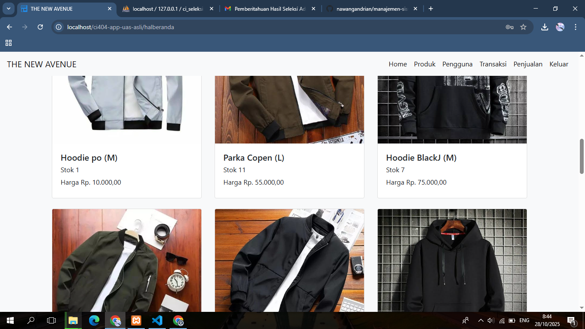
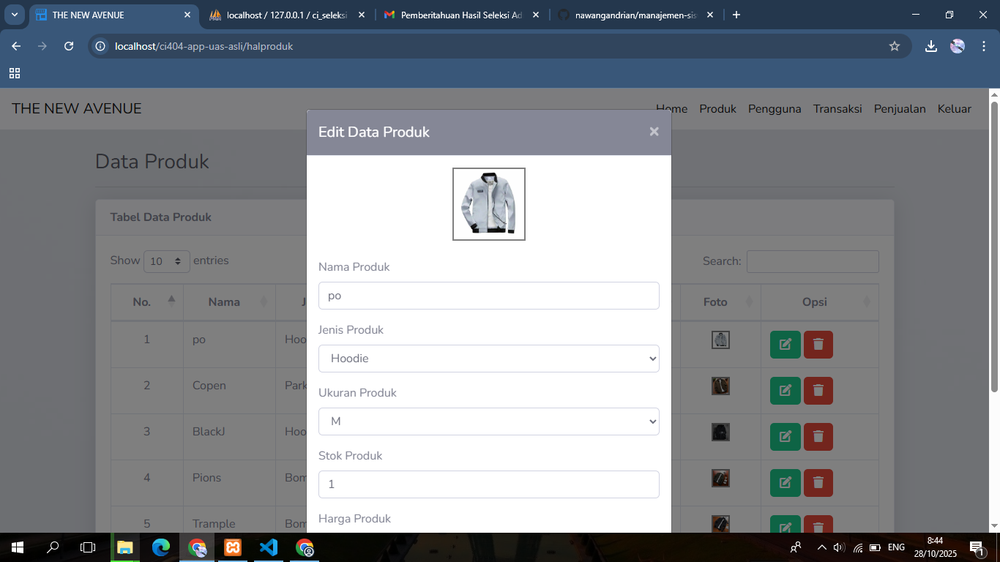
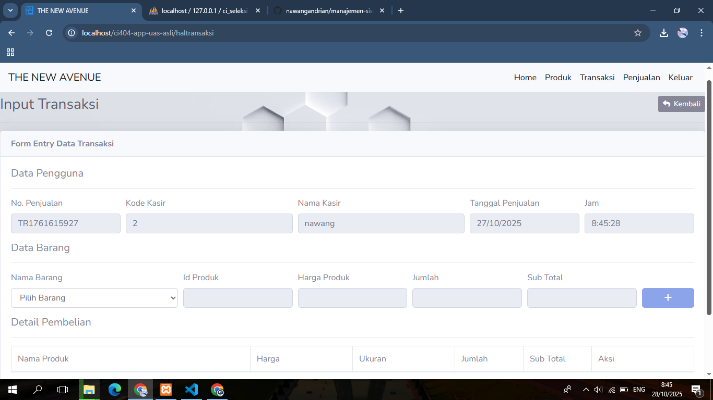

<p align="center">
  <a href="https://codeigniter.com" target="_blank">
    
  </a>
</p>

<p align="center">
  <a href="https://github.com/codeigniter4/CodeIgniter4/actions"></a>
  <a href="https://packagist.org/packages/codeigniter4/framework"></a>
  <a href="https://packagist.org/packages/codeigniter4/framework"></a>
  <a href="https://opensource.org/licenses/MIT"></a>
</p>

# 🧥 Best Jacket - The New Avenue Store

**"On Your Life"**

Tunggu apa lagi?  
Temukan jaket yang sesuai dengan gaya Anda dan lengkapi penampilan Anda dengan koleksi terbaru dari **The New Avenue Jacket Store**.

---

## 🛒 Tentang Aplikasi

**Best Jacket** adalah **aplikasi sistem penjualan berbasis kasir** yang dibangun menggunakan **CodeIgniter 4 manual (tanpa PHP Spark)**.  
Aplikasi ini dirancang untuk membantu pengelolaan transaksi penjualan jaket dengan cepat, ringan, dan mudah digunakan.

### 🔧 Fitur Utama

- **Beranda** — Menampilkan ringkasan informasi penjualan dan navigasi utama.
- **Produk** — Kelola daftar jaket (tambah, ubah, hapus, lihat detail).
- **Transaksi Kasir** — Melakukan transaksi penjualan langsung dengan total otomatis.
- **Struktur Kode Manual** — Tidak menggunakan `php spark`, seluruh konfigurasi dilakukan secara manual.

---

## 🖼️ Screenshot Aplikasi

<p align="center">
  
</p>

<p align="center">
  
</p>

<p align="center">
  
</p>

---

## 🧰 Teknologi yang Digunakan

- **Backend:** CodeIgniter 4 (manual, tanpa spark)
- **Frontend:** HTML, CSS, JavaScript, Bootstrap
- **Database:** MySQL
- **\*Bahasa Pemrograman:** PHP 7.2+
- **Version Control:** Git & GitHub

---

## ⚙️ Cara Menjalankan Aplikasi (Localhost)

1. **Clone repository:**
   ```bash
   git clone https://github.com/nawangandrian/best-jacket.git
   ```
